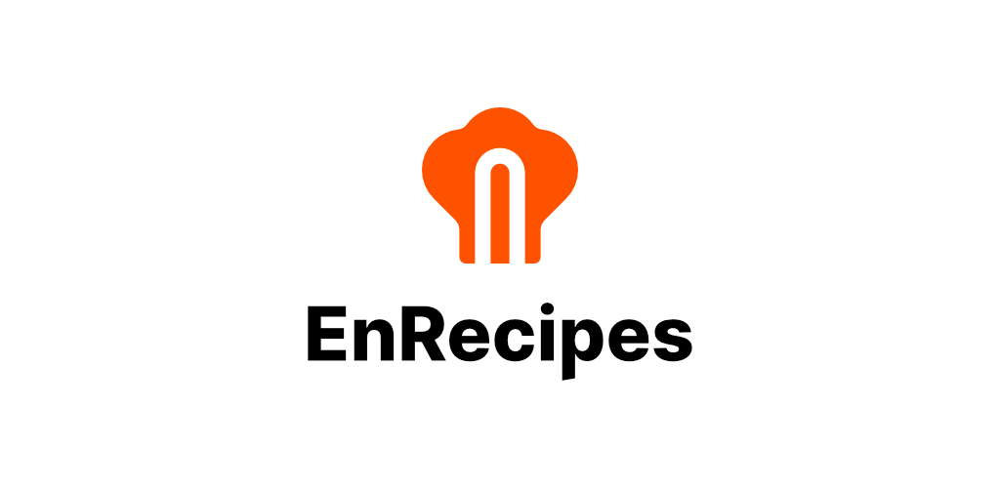
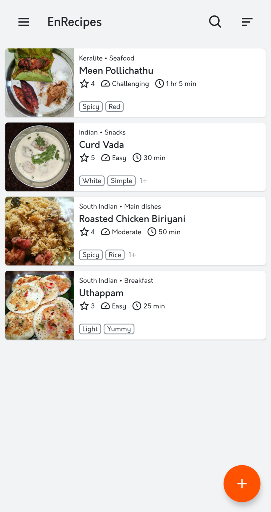
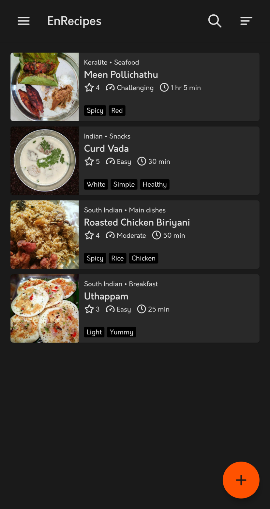
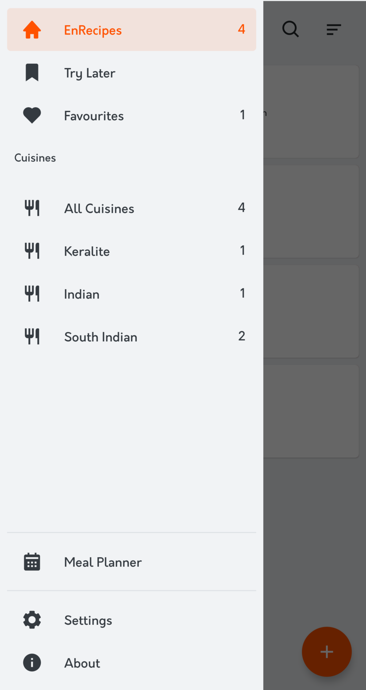
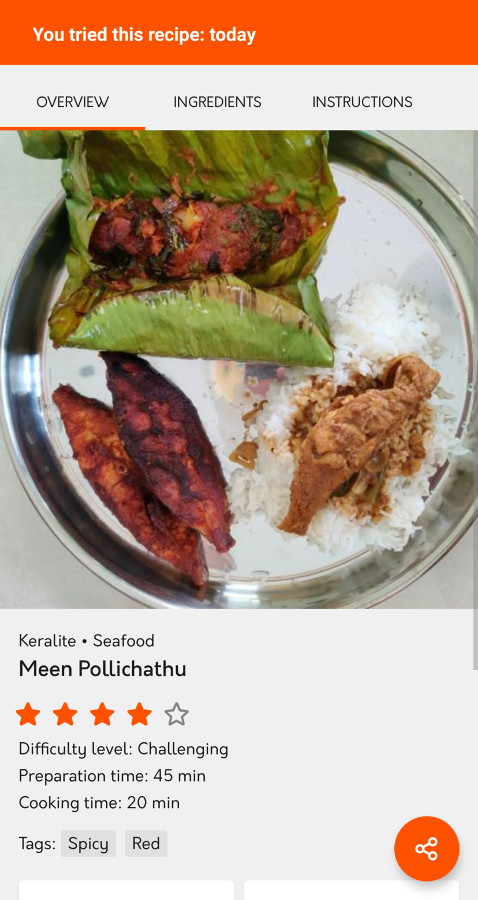
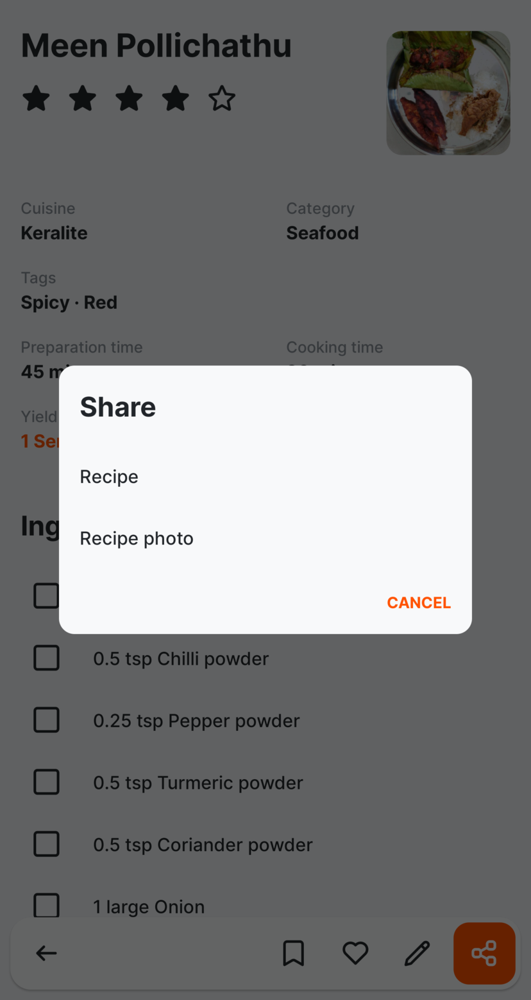
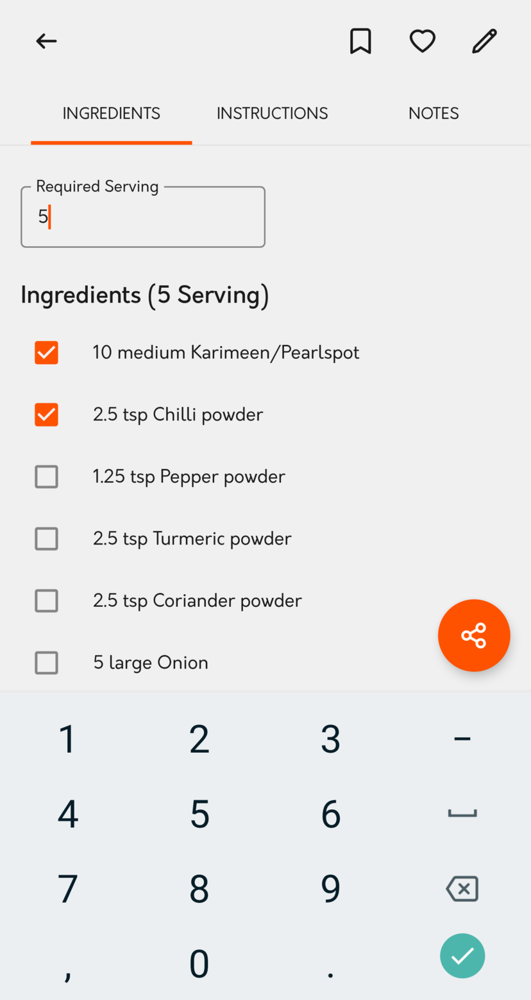
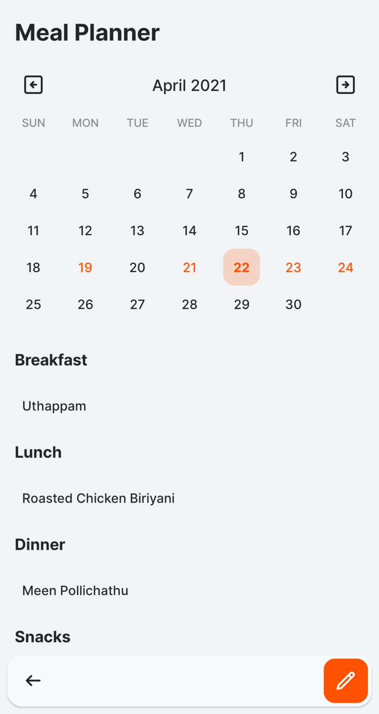
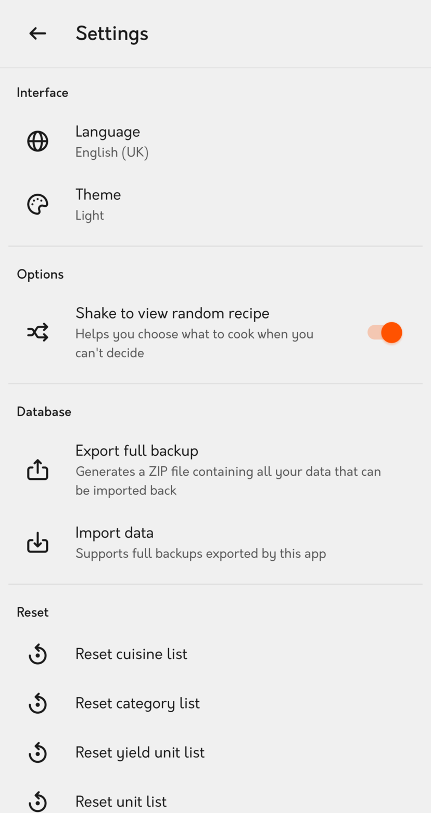

<h3 align="center">A simple, offline recipe manager</h3>
<h4 align="center">EnRecipes is an easy to use, privacy-friendly digital cookbook that lets you create, manage and share your own recipes.</h4>
 

     

<a href="#features">Features</a> - <a href="#downloads">Downloads</a> - <a href="#screenshots">Screenshots</a> - <a href="#future">Future</a> - <a href="#contributors">Contributors</a> - <a href="#credits">Credits</a> - <a href="#license">License</a>

<a href="https://github.com/vishnuraghavb/EnRecipes/wiki/User-Guide">User Guide</a> - <a href="https://github.com/vishnuraghavb/EnRecipes/projects/1">Roadmap</a> - <a href="https://github.com/vishnuraghavb/EnRecipes/blob/main/CONTRIBUTING.md">Contribution Guide</a> - <a href="https://github.com/vishnuraghavb/EnRecipes/blob/main/PRIVACY.md">Privacy Policy</a> - <a href="https://t.me/enrecipes/">Telegram Group</a> - <a href="https://enrecipes.vercel.app/">Website</a> - <a href="https://www.vishnuraghav.com/donate/">Donate</a>

## Features

-   Create recipes quickly
-   Add photo, notes and combinations to your recipes
-   Organise your recipes by cuisine, category and tags
-   Mark recipes as Favourites and add them to your Try Later list
-   Quickly search for recipes by name, ingredient or tag
-   Scale your recipe ingredients to serve more or less people
-   Get notified of the last time you tried a recipe
-   Share your recipe to anyone by any means as a nicely formatted message. You can share the recipe photo too
-   Shake device to view random recipe
-   Create meal plans
-   Import/Export recipes
-   Light & Dark theme
-   No annoying ads or pop-ups
-   No internet access is required and never asks for any unwanted permissions
-   Private by Design
-   100% free and open-source

**Languages supported**: Danish, Dutch, English, German, Portuguese, Russian, Spanish and Tamil

Check the [Roadmap](https://github.com/vishnuraghavb/EnRecipes/projects/1) for upcoming features.

Please read the <a href="https://github.com/vishnuraghavb/EnRecipes/wiki/User-Guide">User Guide</a> to get the most out of EnRecipes.

## Downloads

You can get the latest release [here](https://github.com/vishnuraghavb/EnRecipes/releases/latest)

## Screenshots

## Having issues, suggestions and feedback?

You can,

-   [Create an issue here](https://github.com/vishnuraghavb/EnRecipes/issues)
-   [Join the Telegram group](http://t.me/enrecipes) (quicker replies and best for discussion)
-   Contact me at apps@vishnuraghav.com

## Future

Check out the [roadmap](https://github.com/vishnuraghavb/EnRecipes/projects/1) to see the upcoming features of EnRecipes.

Your feedback and suggestions are very important to make EnRecipes the best. If you have an idea to improve EnRecipes, [do let me know](#having-issues-suggestions-and-feedback). I'm always open to ideas ;)

## Contributors

-   [mondstern](https://codeberg.org/mondstern) (Translations: Danish, Dutch and German)(discontinued)
-   [EpicalXYZ](https://github.com/epicalxyz) (Translations: Portuguese)
-   [dm9pZCAq](https://github.com/dm9pZCAq) (Translations: Russian)
-   [AHaro88](https://github.com/taraletti) (Translations: Spanish)
-   [RAPXT](https://github.com/RAPXT) (Translations: German)

### Help translate EnRecipes

EnRecipes is being translated using Weblate.

## Credits

This app was written in my free time using NativeScript-Vue. I would like to thank all those people who helped me understand the concepts during the process and my special thanks to the NativeScript team and the community. I also would like to thank the members of the Telegram EnRecipes group for contributing their ideas for this project.

### Recipes used in the Screenshots

-   **Meen Pollichathu** by [Bency Veronica](https://www.instagram.com/bencys_lil_kitchen)
-   **Curd Vada** by P. Shanmugalakshmi
-   **Roasted Chicken Biriyani** by [Ranga](https://www.youtube.com/channel/UC6ONI92scjwMmk3IITKIx-g)

### Assets

-   [Boxicons](https://boxicons.com/)
-   Logo by [Vishnu Raghav](https://www.vishnuraghav.com/)

## License

    EnRecipes - a simple, offline recipe manager.
    Copyright (C) 2020  Vishnu Raghav B

    This program is free software: you can redistribute it and/or modify
    it under the terms of the GNU General Public License as published by
    the Free Software Foundation, either version 3 of the License, or
    (at your option) any later version.

    This program is distributed in the hope that it will be useful,
    but WITHOUT ANY WARRANTY; without even the implied warranty of
    MERCHANTABILITY or FITNESS FOR A PARTICULAR PURPOSE.  See the
    GNU General Public License for more details.

    You should have received a copy of the GNU General Public License
    along with this program.  If not, see <https://www.gnu.org/licenses/>.

## Support me

